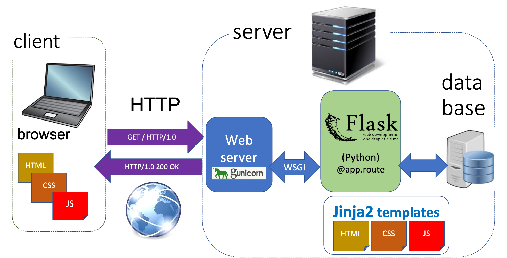
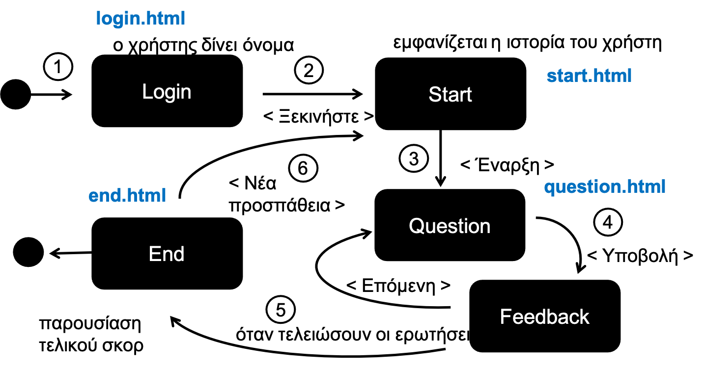

# Εισαγωγή στις τεχνολογίες του διαδικτύου
#### ECE_Y210 Εισαγωγή στην Επιστήμη του Ηλεκτρολόγου Μηχανικού


Το αντικείμενο αυτής της ενότητας είναι να εξετάσουμε τις βασικές τεχνολογίες που χρησιμοποιούνται στις εφαρμογές του διαδικτύου και να δούμε ένα παράδειγμα μιας εφαρμογής με χρήση των τεχνολογιών HTML/CSS/JavaScript στον πελάτη που να εξυπηρετείται από μια εφαρμογή Python στον server.

Το **διαδίκτυο (internet)** είναι ένα σύνολο από πρωτόκολλα και υποδομές (δίκτυα) που επιτρέπουν τη διασύνδεση υπολογιστών και επικοινωνία μεταξύ εφαρμογών. Η πιο σημαντική εφαρμογή του διαδικτύου είναι ο **παγκόσμιος ιστός (web)**.


[χάρτης από το submarinecablemap.com](https://www.submarinecablemap.com/#/)

Στις επόμενες ενότητες θα δούμε το πρωτόκολλο HTTP που είναι ο τρόπος επικοινωνίας browser/server, τη γλώσσα HTML/CSS, τη βιβλιοθήκη Flask που μάς επιτρέπει να δρομολογούμε και να ανταποκρινόμαστε σε αιτήματα που έρχονται από τον φυλλομετρητή στον εξυπηρετητή, τη γλώσσα Jinja2 που μάς επιτρέπει να σχεδιάζουμε ιστοσελίδες με παραμετρικό τρόπο και τέλος διανομή της εφαρμογής μας σε μια πλατφόρμα φιλοξένιάς της. Όλα αυτά θα γίνουν μέσα από ένα παράδειγμα ανάπτυξης μια εφαρμογής που ελέγχει τις γνώσεις μας στην Python.

<div style="page-break-before: always;">
--
</div>

## 1. Το πρωτόκολλο HTTP

Οι εφαρμογές του παγκόσμιου ιστού χρησιμοποιούν το πρωτόκολλο **HTTP (hyper-text transfer protocol)**, για την ανταλλαγή μηνυμάτων μεταξύ ενός **πελάτη (browser)** και ενός **εξυπηρετητή (web server)** οι οποίοι είναι οι δύο βασικοί κόμβοι των εφαρμογών του παγκόσμιου ιστού.

Το πρωτόκολλο HTTP ορίστηκε πρώτη φορά το 1989 από τον Tim Berners-Lee. Σήμερα είμαστε στην έκδοση HTTP/2.
Τα μηνύματα HTTP είναι δομημένα κείμενα, έχουμε δύο κατηγορίες μηνυμάτων:
* Μηνύματα **αιτήματα** (από τον φυλλομετρητή στον εξυπηρετητή): GET ή POST
* Μηνύματα **αποκρίσεις** (από τον εξυπηρετητή στον φυλλομετρητή).

Ακολουθεί ένα πρόγραμμα που μάς επιτρέπει να εισάγουμε μια διεύθυνση URL και μάς επιστρέφει την κεφαλίδα της απόκρισης HTTP που λαμάνουμε. Χρησιμοποιεί τη βιβλιοθήκη requests.

```python
# πρόγραμμα που ζητάει ένα url και επιστρέφει την κεφαλίδα της απόκρισης HTTP
import requests

while True:
    url = input('url:')
    if url == '': break
    if not url.startswith('http'):
        url = 'http://'+ url
    try:
        with requests.get(url) as response:
            print("\nRESPONSE STATUS: ", response.status_code)
            print("RESPONSE HEADER")
            for key, value in response.headers.items():
                print("{:30s} {}".format(key, value))
    except:
        print('error opening', url)
```
(o κώδικας)[example1-http.py]
Ένα παράδειγμα χρήσης:

<pre>
url:http://hci.ece.upatras.gr/
RESPONSE STATUS:  200
RESPONSE HEADER
Date                           Sat, 27 Mar 2021 12:30:29 GMT
Server                         Apache/2.4.18 (Ubuntu)
Set-Cookie                     language=en; expires=Sun, 27-Mar-2022 12:30:29 GMT; Max-Age=31536000; path=/
Link                           <https://hci.ece.upatras.gr/wp-json/>; rel="https://api.w.org/"
Vary                           Accept-Encoding
Content-Encoding               gzip
Content-Length                 9848
Keep-Alive                     timeout=5, max=100
Connection                     Keep-Alive
Content-Type                   text/html; charset=UTF-8
</pre>

Πειραματιστείτε με το πρόγραμμα αυτό στέλνοντας μηνύματα σε διάφορες διευθύνσεις του διαδικτύου, δέστε προσεκτικά την κεφαλίδα της απόκρισης που πήρατε, μπορείτε να βγάλετε συμπεράσματα για το τι τύπου είναι ο εξυπηρετητής που σάς απάντησε (είναι η κεφαλίδα `Server`), τι τύπου είναι η απόκριση, (`Content-Type`), αν επισυνάπτονται αρχεία cookies και τι διάρκεια ζωής έχουν (`Set-Cookie`), κλπ. )

Επίσης σκεφτείτε με ποιον τρόπο θα μπορούσατε να χρονομετρήσετε το συνολικό χρόνο από την αποστολή του αιτήματος μέχρι την παραλαβή της απόκρισης (χρήση της `time.process_time()`)

#### Συνηθισμένοι κωδικοί σε μηνύματα απόκρισης HTTP:
Στο προηγούμενο παράδειγμα παρατηρήσαμε ότι το Response status ήταν 200, αυτό σημαίνει ότι το μήνυμα μας το επεξεργάστηκε ο εξυπηρετητής με επιτυχία, ωστόσο έχει ενδιαφέρον να διερευνήσουμε τι άλλους κωδικούς κατάστασης της απόκρισης μπορεί να λάβουμε και ποια η σημασία των κωδικών αυτών.

Παρακάτω ακολουθεί ένας συνοπτικός πίνακας.

* 1xx: μήνυμα πληροφορίας 
* 2xx: κατάσταση επιτυχούς επεξεργασίας
* 3xx: προώθηση του Client σε διαφορετικό URL
* 4xx: σφάλμα προερχόμενο από τον Client
* 5xx: σφάλμα προερχόμενο από τον Server

### Αρχιτεκτονική εφαρμογών διαδικτύου

Κλείνοντας την εισαγωγική ενότητα θα δώσουμε μια συνοπτική εικόνα της αρχιτεκτονικής μιας εφαρμογής του διαδικτύου με βάση και τις τεχνολογίες που θα χρησιμοποιήσουμε σε αυτή την ενότητα.



Από την εικόνα αυτή παρατηρούμε πόσο σύνθετη είναι η αρχιτεκτονική μιας εφαρμογής διαδικτύου.

Τα κύρια στοιχεία είναι ένας εξυπηρετητής (web server) που στο παράδειγμά μας θα χρησιμοποιήσουμε ένα τμήμα της βιβλιοθήκης Flask, όταν όμως φιλοξενήσουμε την εφαρμογή μας σε δημόσιο χώρο φιλοξενίας (Heroku) θα χρησιμοποιήσουμε τη βιβλιοθήκη [Gunicorn](https://gunicorn.org/) της Python. Ένα άλλο στοιχείο της αρχιτεκτονικής είναι το πρωτόκολλο επικοινωνίας μεταξύ του εξυπηρετητή και της εφαρμογής μας που είναι το WSGI. Η ίδια η εφαρμογή που θα αναπτύξουμε θα είναι με χρήση της βιβλιοθήκης Flask, ενώ το περιεχόμενο των σελίδων που θα στείλουμε στον πελάτη θα είναι γραμμένο σε HTML/CSS/JavaScript. 

Στην επόμενη ενότητα θα κάνουμε μια σύντομη παρουσίαση των τεχνολογιών αυτών συγγραφής και μορφοποίησης ιστοσελίδων.


<div style="page-break-after: always;"></div>

## 2. Η γλώσσα συγγραφής ιστοσελίδων HTML / γλώσσα μορφοποίησης CSS

H HTML είναι γλώσσα επισημείωσης περιεχομένου (markup) για την οργάνωση μιας ιστοσελίδας, με τη γλώσσα αυτή ορίζουμε το περιεχόμενο και τη δομή μιας ιστοσελίδας.

Ας δούμε στη συνέχεια τη δομή ενός τυπικού αρχείου HTML: 

```html
<!DOCTYPE html>
<html>
    <head>
    	<meta charset="utf-8">        
        <title>Ο τίτλος</title>
        <style>    
            body {
                font-family: sans-serif;
                background-color: yellow;
            }
        </style>
    </head>
    <body>	
            <h1>Κεφαλίδα 1</h1>	
            <p> Πρώτη παράγραφος.</p>    
    </body>
</html>
```

Το αρχείο αυτό παράγει το παρακάτω αποτέλεσμα:


Όπως παρατηρούμε το αρχείο μετά την αρχική δήλωση στην πρώτη γραμμή που λέει στον φυλλομετρητή ότι είναι έγγραφο HTML5, στη συνέχει έχουμε μια ιεραρχία από στοιχεία με ρίζα το στοιχείο `<html>` και παιδιά του τα στοιχεία `<head>` και `<body>`, που και αυτά με τη σειρά τους περιέχουν άλλα στοιχεία.

Ένα στοιχείο HTML έχει την εξής δομή:

```html
<etiketa παράμετρος="τιμή"> περιεχόμενο </etiketa>
```

ένα παράδειγμα: 
```html
<p id="p1"> καλημέρα </p>
```

Στη συνέχεια περιγράφονται οι βασικές ετικέτες με τις οποίες μπορούμε να δημιουργήσουμε στοιχεία HTML.

### Τυπικές ετικέτες

* `<html>, <head>, <body>` ετικέτες δόμησης του εγγράφου
* `<meta>` μετα-δεδομένα στην κεφαλίδα του εγγράφου
* `<style>` εισαγωγή κανόνων μορφοποίησης (CSS), σε επόμενη ενότητα θα περιγράψουμε τη σύνταξή τους.
* `<script>` εισαγωγή κώδικα JavaScript
* `<h1>...</h1>, <h2>, ... <h6>` Επικεφαλίδες διαφόρων επιπέδων     
* `<ul> …</ul>` 	Μη διατεταγμένη λίστα 
* `<ol> … </ol>`	Διατεταγμένη λίστα (1.,2.,3. …)
* `<pre>` κείμενο που διατηρεί τη στοίχισή του (pre-frormatted), χρήσιμο για κώδικα.
* `<p> … </p>	`	Παράγραφος (block element)
* `<div> …	</div>` Oρισμός μπλοκ, που αρχίζει από νέα γραμμή και αλλαγή γραμμής στο τέλος
* `<span> … </span>` ορισμός μικρής περιοχής κειμένου  (inline element)
* `<form>` φόρμα εισαγωγής στοιχείων από τον χρήστη
* `<input>` στοιχείο φόρμας
* `<table>` πίνακας
* `<a>` (άγκυρα) υπερσύνδεσμος
* `` εικόνα
* `<video>` βίντεο
* `<audio>` ήχος

Ένα στοιχείο HTML μπορεί να φέρει μοναδική **ταυτότητα** που ορίζεται με το γνώρισμα `id` ή να ανήκει σε μια **κλάση**, την οποία μοιράζονται διάφορα στοιχεία, η κλάση ορίζεται με το γνώρισμα `class`.

Ένα παράδειγμα ορισμού της ταυτότητας ενός στοιχείου `<div>`.
```html
<div id="myid"> κείμενο </div>
```
Οι ταυτότητες `id` και οι κλάσεις `class` χρησιμοποιούνται για την συσχέτιση των στοιχείων με κανόνες εμφάνισης του στοιχείου CSS.

#### Ένα παράδειγμα
Έστω ότι θέλουμε να ζητήσουμε από τον χρήστη να διαλέξει μια από τις πιθανές απαντήσεις στο παρακάτω ερώτημα:


Ο παρακάτω κώδικας HTML υλοποιεί την παραπάνω συμπεριφορά:
```html
<form>
    <div id="quiz">
    Τι θα τυπώσει το παρακάτω πρόγραμμα;
    <pre>
def f():
    a = 7
    print(a, end = ' ')
a = 5
f()
print(a, end = ' ')
    </pre>
    Απάντηση (επιλέξτε):
    </div>
    <ol>
        <li><input type="radio" name="answer" value="1"> 5 5</li>
        <li><input type="radio" name="answer" value="2"> 7 5</li>
        <li><input type="radio" name="answer" value="3"> 7 7</li>
        <li><input type="radio" name="answer" value="4"> NameError</li>
        <li><input type="radio" name="answer" value="5"> δεν γνωρίζω</li>
    </ol>
    <button>Υποβολή</button>
</form>
```
(Την πλήρη λύση θα βρείτε στο αρχείο `example2-question.html`)

Να σημειωθεί ότι δημιουργήσαμε μια φόρμα `<form>` μέσα στην οποία τοποθετήσαμε κείμενο και κώδικα (στοιχείο `<pre>`), καθώς και μια σειρά από στοιχεία `<input type="radio">` με κοινό `name`, όταν ο χρήστης επιλέξει ένα από αυτά και υποβάλουμε την φόρμα, θα επιστρέψει την αντίστοιχη τιμή `value`.

Περισσότερες οδηγίες για τη σύνταξη της HTML μπορείτε να βρείτε στο [w3 HTML Tutorial](https://www.w3schools.com/html/default.asp)

**Άσκηση**: Πώς θα μπορούσατε να αλλάξετε τον κώδικα ώστε το πρόγραμμα να επιστρέφει αντί για answer, μια μεταβλητή score, να βαθμολογεί με 1 τη σωστή απάντηση, -1 τη λάθος και 0 την απάντηση "δεν γνωρίζω"


### Κανόνες CSS

Όπως είδαμε στον αρχικό μας παράδειγμα της HTML για να εμφανιστεί το κείμενο με γραμματοσειρά "sans-serif" (χωρίς πατούρες,  έντονες άκρες) και με κίτρινο υπόβαθρο είχαμε ενσωματώσει στο `<head>`, ένα στοιχείο `<style>` που περιείχε κανόνες CSS. Ένας κανόνας CSS ορίζει την εμφάνιση των στοιχείων HTML της ιστοσελίδας.

Για παράδειγμα αν επιθυμούμε τα στοιχεία `<h1>` και `<p>` να περιέχουν κείμενο χρώματος `blue`  με εσωτερικό περιθώριο `1rem` o σχετικός κανόνας CSS θα έχει την εξής μορφή:
```css
h1, p {
    color: blue;
    padding: 1rem;
}
```
Στο παράδειγμα αυτό οι `h1, p` λέγονται **επιλογείς**, οι `color`, `padding` είναι οι **ιδιότητες** και `blue`, `1rem` είναι αντίστοιχα οι τιμές των ιδιοτήτων αυτών. Να σημειωθεί εδώ ότι συνήθως 1rem= 16px.

Οι επιλογείς μπορεί να αφορούν κλάσεις (πχ `<ετικέτα class="classname">`) ή τις ιδιότητες στοιχείων πχ `<ετικέτα id="ταυτότητα">`

Για παράδειγμα ο κανόνας 

```css
#myid {font-size: 2rem;}
```
ορίζει ότι το μέγεθος χαρακτήρων του στοιχείου με ταυτότητα `id="myid"` είναι 2 rem (root em).

Οι κανονές CSS μπορεί να περιέχονται σε ένα εξωτερικό αρχείο .css ή μέσα στο ίδιο το αρχείο .html μέσα στην ετικέτα `<style>`.

Κάθε στοιχείο HTML εμφανίζεται ως ένα ορθογώνιο κουτί.
Το κουτί αυτό αποτελείται από 4 περιοχές: περιεχόμενο, εσωτερικό περιθώριο (padding), περίγραμμα (border), εξωτ.περιθώριο (margin).
Στο παράδειγμα (από τα εργαλεία developer του chrome) ένα στοιχείο  έχει διαστάσεις περιεχομένου 750x200px  και εξωτερικό περιθώριο 8px.


Περισσότερες οδηγίες για τη σύνταξη κανόνων CSS μπορείτε να βρείτε στο [web3 CSS tutorial](https://www.w3schools.com/css/default.asp)


<div style="page-break-after: always;"></div>

**Άσκηση**: Πώς θα μπορούσατε να αλλάξετε τον κώδικα της άσκησης ώστε το χρώμα υποβάθρου του κώδικα να γίνει #d5ecc2 και της σελίδας #eeebdd, καθώς και να υπάρχει περιθώριο ανάμεσα στην άκρη του παράθυρου και το περιεχόμενο.


## 3. Κατασκευάζουμε έναν εξυπηρετητή με Python/Flask

Στις προηγούμενες ενότητες είδαμε τις βασικές τεχνολογίες που χρησιμοποιούνται για να δημιουργήσουμε μια ιστοσελίδα HTML/CSS (Δεν αναφερθήκαμε στην τρίτη βασική τεχνολογία που είναι η JavaScript, περισσότερα για αυτή στο [web3 JavaScript tutorial](https://www.w3schools.com/js/DEFAULT.asp)).

Ήρθε η ώρα να δημιουργήσουμε έναν εξυπηρετητή ο οποίος θα ανταποκρίνεται σε αιτήματα και θα αποστέλει προς τον πελάτη ιστοσελίδες όπως αυτή με το quiz του παραδείγματος που είδαμε. Το πρόγραμμα που θα φτιάξουμε δεν θα μάς στέλνει μόνο ερωτήσεις, αλλά θα παίρνει και την απάντησή μας και θα υπολογίζει το σκορ μας.

Ένας εξυπηρετητής του παγκόσμιου ιστού μπορεί να γραφτεί σε διάφορες γλώσσες προγραμματισμού, εδώ θα δοκιμάσουμε τη γλώσσα Python και τη βιβλιοθήκη [Flask](https://flask.palletsprojects.com/en/1.1.x/).

Πρέπει αρχικά να εγκαταστήσουμε την Flask και να δημιουργήσουμε ένα απλό πρόγραμμα με βάση και τις οδηγίες που θα βρούμε στο [Flask tutorial](https://flask.palletsprojects.com/en/1.1.x/installation/)

#### Εγκατάσταση της Flask 

Δημιουργούμε τον φάκελο (quiz-server) στον οποίο θα δημιουργήσουμε τον εξυπηρετητή μας `server.py`

Από το terminal του vs code, αρχικά δημιουργούμε ένα  virtual environment με την εντολή (windows):

>$ py -3 -m venv venv

(mac)
>$ python3 -m venv venv

Στη συνέχεια ενεργοποιούμε αυτό το virtual environment (εικονικό περιβάλλον) που δημιουργήσαμε

(windows)
> venv\Scripts\activate

*σημείωση:* σε εκδόσεις των windows πιθανόν στο terminal (powershell) να μην μάς επιτρέψει την ενεργοποίηση του εικονικού περιβάλλοντος με κάποιο μήνυμα του τύπου: `Activate.ps1 is not digitally signed. You cannot run this script`.
Για να αντιμετωπίσουμε το πρόβλημα σύμφωνα με [υπόδειξη](https://stackoverflow.com/questions/18713086/virtualenv-wont-activate-on-windows) πρέπει πρώτα να δώσετε την εντολή:
> Set-ExecutionPolicy Unrestricted -Scope CurrentUser -Force

(mac)
>$ . venv/bin/activate

Η απόκριση είναι:
>(venv) nma@nmac quiz-server % 

Αυτό είναι ένδειξη ότι έχει ενεργοποιηθεί το virtual environment στο οποίο μέσα θα εγκαταστήσουμε τη Flask.

Το virtual environment είναι ένας προστατευμένος χώρος της Python που δεν επηρεάζεται από άλλες βιβλιοθήκες που μπορεί να έχουμε εγκαταστήσει στον υπολογιστή μας, ή νεότερες εγκαταστάσεις της γλώσσας ή των εξαρτημάτων.

Είναι γενικά καλή πρακτική σύνθετες εφαρμογές όπως ο εξυπηρετητής Flask να εγκαθίστανται σε εικονικά περιβάλλοντα.

Η εγκατάσταση της Flask γίνεται με το εργαλείο `pip`

>$ pip install Flask

Η εγκατάσταση της Flask, περιλαμβάνει μια σειρά εξαρτήματα, όπως την Werkzeug που υλοποιεί το πρωτόκολλο WSGI σύνδεσης ενός προγράμματος Python με ένα webserver, την Jinja2 που είναι μια βιβλιοθήκη template για εισαγωγή παραμετρικά περιεχομένου σε μια ιστοσελίδα, την click, που επιτρέπει την επικοινωνία με τη flask από γραμμή εντολών, την MarkupSafe για έλεγχο ασφάλειας στο περιεχόμενο που εισάγουμε στις ιστοσελίδες.

Στη συνέχεια θα δημιουργήσουμε την πιο απλή εφαρμογή εξυπηρετητή με τη Flask. Θα αντιγράψουμε το παράδειγμα από την [ιστοσελίδα της Flask](https://flask.palletsprojects.com/en/1.1.x/quickstart/#a-minimal-application) σε ένα αρχείο `server.py`:

```python
from flask import Flask
app = Flask(__name__)

@app.route('/')
def hello_world():
    return '<h1>καλή σας μέρα!</h1>'
```
Οι δύο πρώτες γραμμές δημιουργούν ένα στιγμιότυπο της εφαρμογής Flask. Η εφαρμογή Flask επικοινωνεί με τον εξυπηρετητή ιστού (web server) με το πρωτόκολλο WSGI, τον στάνταρ τρόπο που έχει ένα πρόγραμμα Python να επικοινωνεί με ένα εξυπηρετητή ιστού.
Ο δημιουργός του στιγμιότυπου Flask() δέχεται ως παράμετρο το κυρίως πρόγραμμα της εφαρμογής που είναι το όνομα του ίδιου του αρχείου `__name__`.

Η κύρια λειτουργία της εφαρμογής είναι η δρομολόγηση αιτημάτων που φτάνουν στον εξυπηρετητή. Τα αιτήματα φτάνουν σε URL, σε διευθύνσεις του ιστού. Η εφαρμογή μας δημιουργεί ένα χάρτη από διευθύνσεις αιτημάτων και του αντίστοιχου κώδικα που θα ανταποκριθεί σε κάθε ένα αίτημα.

Η πρώτη μας εφαρμογή έχει μόνο ένα τέτοιο σημείο δρομολόγησης. Τα αιτήματα που φτάνουν στη σχετική διεύθυνση "/" τα χειρίζεται η συνάρτηση hello_world(), η οποία όταν κληθεί επιστρέφει μια συμβολοσειρά.

Αν ο εξυπηρετητής ήταν συνδεδεμένος για παράδειγμα στη διεύθυνση "www.server.com", κάθε φορά που έφτανε ένα αίτημα στη διεύθυνση αυτή θα το εξυπηρετούσε η αντίστοιχη συνάρτηση. 

Αν είχαμε ένα ακόμη σημείο δρομολόγησης "/login", αυτό θα αφορούσε αιτήματα που φτάνουν στη διεύθυνση "www.server.com/login".

Στο τέλος του προγράμματος προσθέτουμε την εντολή που ενεργοποιεί την εφαρμογή Flask και μάλιστα σε debug κατάσταση:

```python

if __name__ == "__main__":
    app.run(debug=True)
```

Τώρα είμαστε έτοιμοι να τρέξουμε την εφαρμογή μας και αυτό θα πρέπει να γίνει απο τη γραμμή εντολών (terminal):

>python server.py

Η εφαρμογή Flask μάς γνωστοποιεί ότι είναι ενεργή και έτοιμη πλέον να εξυπηρετήσει αιτήματα:

<pre style="color:grey">
 * Serving Flask app "server" (lazy loading)
 * Environment: production
   WARNING: This is a development server. Do not use it in a production deployment.
   Use a production WSGI server instead.
 * Debug mode: on
 * Running on http://127.0.0.1:5000/ (Press CTRL+C to quit)
 * Restarting with stat
 * Debugger is active!
 * Debugger PIN: 318-838-524
 </pre>

Να σημειωθεί ότι μαζί με την Flask έχουμε κατεβάσει ένα web server που τρέχει σε τοπικό επίπεδο.

 Αν πάρουμε μια απάντηση όπως η παραπάνω, αυτό σημαίνει ότι ο εξυπηρετητής είναι διαθέσιμος και μπορούμε να συνδεθούμε σε αυτόν από τον φυλλομετρητή μας πληκτρολογώντας τη διεύθυνση localhost:5000

 localhost είναι το συμβολικό όνομα για τον τοπικό υπολογιστή (127.0.0.1) ενώ η θύρα στην οποία θα πρέπει να συνδεθούμε από τον φυλλομετρητή ορίζεται η 5000. 
 
 ***Σημείωση**: συνήθως η θύρα που εξυπηρετούνται εφαρμογές του παγκόσμιου ιστού είναι η θύρα 80, και η οποία παραλείπεται από τις διευθύνσεις σε συνήθη χρήση, αφού εννοείται, εδώ χρησιμοποιούμε μια άλλη θύρα για να μην διαταράξουμε τη συνήθη χρήση του φυλλομετρητή μας.*

 Αν όλα πάνε καλά όταν ανοίξουμε τον φυλλομετρητή στη διεύθυνση localhost:5000, θα δούμε το μήνυμα "καλή σας μέρα!" που μάς έστειλε ο εξυπηρετητής.

#### Εξυπηρέτηση ιστοσελίδας

Αν θέλουμε να πάρουμε μια ιστοσελίδα, πχ το αρχείο `question.html` αντί για απλά το κείμενο της καλημέρας, όπως στο προηγούμενο παράδειγμα, αυτό θα πρέπει να γίνει αλλάζοντας το σημείο δρομολόγησης (route) ώστε να κληθεί η ιστοσελίδα με την μέθοδο `render_tamplate()` της Flask, ως εξής:

```python
import render_template from Flask
...
@app.route('/')
    def quiz():
        return render_template('question.html')
```

Αυτό προϋποθέτει ότι έχουμε δημιουργήσει ένα φάκελο `templates` και εκεί  έχουμε αποθηκεύσει το αρχείο `question.html`. 

Όταν τώρα στον φυλλομετρητή δώσουμε τη διεύθυνση `localhost:5000` θα δούμε τη γνωστή φόρμα του τεστ, που είχαμε δει σε προηγούμενη ενότητα, όμως τώρα μάς την έστειλε η εφαρμογή Flask.

#### Παραμετρικά σημεία δρομολόγησης

Επίσης είναι δυνατόν να έχουμε παραμετρικά σημεία δρομολόγησης, όπως στο παράδειγμα:
```python
@app.route('/user/<name>')
def user(name):
    return "Καλή σου μέρα {}!".format(name)
```
Στην περίπτωση αυτή ανάλογα με την τιμή του URL έχουμε διαφορετικό μήνυμα στον χρήστη. 

Όταν φορτώσουμε τη σελίδα `localhost:500/user/Niko` θα πάρουμε στον φυλλομετρητή μας το μήνυμα 
>Καλή σου μέρα Niko!

Αυτή η δυνατότητα είναι ιδιαίτερα χρήσιμη για να μεταφέρουμε πληροφορία στον εξυπηρετητή από τον πελάτη, μέσω του URL.


<div style="page-break-after: always;"></div>

## 4. Η μηχανή template Jinja2

Το αρχείο `question.html` που στείλαμε στο προηγούμενο παράδειγμα ήταν απλά ένα στατικό ήδη έτοιμο αρχείο, γραμμένο στη γλώσσα HTML/CSS. 

θα ήταν καλό όμως να μπορούσουμε να αλλάζαμε το περιεχόμενό του, ώστε με το ίδιο αρχείο να στέλνουμε διαφορετικές ερωτήσεις του τεστ. 

Αυτό μπορεί να γίνει με χρήση της μηχανής template **Jinja2** που περιλαμβάνεται στο Flask.

Αν υποθέσουμε ότι επιθυμούμε να εισάγουμε το όνομα του χρήστη (μεταβλητή `name` στο αρχείο, αυτό γίνεται εισάγοντας τη σχετική μεταβλητή στο αρχείο html ως ακολούθως:

```html
<h1>Python-Quiz - Χρήστης: {{user_name }}</h1>
```
και καλώντας τη μέθοδο σχεδίασης της σελίδας, ως εξής:

```python
return render_template('question.html', user_name=name)
```
Δηλαδή έχουμε ορίσει μια μεταβλητή Jinja2, την `user_name`, στην οποία όταν καλούμε το template περνάμε μια τιμή, αυτή της μεταβλητής `name` της Python. Μέσα στο template εισάγουμε την μεταβλητή μέσα σε διπλά άγκιστρα:

```html
{{ user_name }}
```
Η μηχανή Jinja2 κατά την κλήση της render_template() μεταφέρει την τιμή στη θέση αυτή και αποστέλει στον χρήστη τη σελίδα με το νέο περιεχόμενο.

Σε μια μεταβλητή Jinja2 μπορούμε να εφαρμόσουμε φίλτρα, ως εξής: `{{ variable | filter }}`

Μερικά τέτοια φίλτρα είναι: `lower` (μικρά γράμματα), `upper` (κεφαλαία), `safe` (εκτέλεση του κώδικα HTML). Το τελευταίο φίλτο είναι ιδιαίτερα χρήσιμο για την ενσωμάτωση κώδικα html ο οποίος θα θέλαμε να εκτελεστεί, ώστε για παράδειγμα να μπορούμε να ενσωματώσουμε τον κώδικα python σε ετικέτες `<pre>, </pre>` με συνέπεια o κώδικας να εμφανιστεί με στοίχιση, ώστε να είναι κατανοητός.

Επίσης υπάρχουν άλλες δομές στην Jinja2, όπως η δομή επανάληψης for για επαναληπτική παρουσίαση δεδομένων ενός πίνακα. Αν έχουμε ένα πίνακα `replies`, μπορούμε να παρουσιάσουμε τα στοιχεία του ως λίστα ως εξής:

```html
<ol>

    <li>{{ reply }}</li>

</ol>
```
Με αυτόν τον τρόπο θα παρουσιάσουμε τις απαντήσεις σε ένα ερώτημα πολλαπλής επιλογής, όπως θα δούμε σε μια επόμενη ενότητα.

Μια άλλη χρήσιμη δομή είναι η δομή υπό-συνθήκη εκτέλεσης ενός κώδικα (συνθήκη  if), ακολουθεί ένα παράδειγμα.

```html

    Γειά σου, {{ user }}!

    Καλημέρα σας!

```

#### Κληρονομικότητα Jinja2 templates

H μηχανή template Jinja2 επιτρέπει την κληρονομικότητα μεταξύ templates. Αυτή η ιδιότητα είναι ιδιαίτερα χρήσιμη αν θέλουμε κάποια στοιχεία να τα επαναλάβουμε σε όλες τις ιστοσελίδες, χωρίς να αντιγράψουμε τον ίδιο κώδικα σε πολλά αρχεία, κάτι που μπορεί να είναι πηγή σφαλμάτων, αν για παράδειγμα θέλουμε να κάνουμε αλλαγές.

Ο μηχανισμός κληρονομικότητας εξηγείται στη συνέχεια με ένα παράδειγμα. Έστω ότι έχουμε ένα βασικό αρχείο, το οποίο ονομάζουμε `base.html` και στο οποίο ενσωματώνουμε τα κοινά στοιχεία όλων των ιστοσελίδων, πχ το τμήμα `<head>`, ενώ το τμήμα `<body>` αλλάζει σε διαφορετικές ιστοσελίδες. 

```Jinja2
<!DOCTYPE html>
<html lang="en">
<head>
    <meta charset="UTF-8">
    <meta name="viewport" content="width=device-width, initial-scale=1.0">
    <title>  </title>
    <style>
        ....
    </style>
</head>
<body>
     
    
</body>
</html>
```
Το αρχείο αυτό σε δύο σημεία έχει μπλοκ κώδικα που είναι παραμετρικός, στον *τίτλο* και στο *σώμα* του αρχείου html.

Όλα τα υπόλοιπα στοιχεία πρόκειται να κληρονομηθούν σε όλες τις ιστοσελίδες που θα περιλάβουν το `base.html`.

Να ένα παράδειγμα μιας σελίδας login που κληρονομεί το αρχείο `base.html`.

```Jinja2

 Login  

    <h1> Καλωσήρθατε στο Python-Quiz</h1>
    <form >
        <input type="text" name="name" placeholder="το όνομά σας...">
        <button>Ξεκινήστε</button>
    </form>

```


<div style="page-break-after: always;"></div>


## 5. Παράδειγμα: μεταφέρουμε την εφαρμογή `pythonquiz` στο διαδίκτυο

Έχουμε δημιουργήσει μια εφαρμογή python για αυτο-αξιολόγηση γνώσεων μέσω ερωτήσεων πολλαπλής επιλογής. Η εφαρμογή αρχικά λειτουργεί από γραμμή εντολών (πχ από το IDLE). 

#### Η εφαρμογή python
Όταν ξεκινήσει η εφαρμογή ρωτάει τον χρήστη το όνομά του, τον αναζητάει στη βάση δεδομένων και αν τον βρει του λέει το σκορ που είχε πετύχει σε προηγούμενες προσπάθειες, και στη συνέχεια του κάνει 5 τυχαίες ερωτήσεις από μια βάση δεδομένων ερωτήσεων.

'Ενα παράδειγμα χρήσης της εφαρμογής είναι:

```cli
Δώσε το όνομά σου:kostas
Παίκτης: kostas
Προηγούμενες προσπάθειες:
28-03-21 Sun 17:39:47	score: 100.0%

Ερώτηση 1 από 5
Ερώτηση [Q51]
Ποιο από τα παρακάτω στοιχεία δεν μπορεί να είναι κλειδί ενός λεξικού:
Απαντήσεις:
1	(1,2)
2	[1,2]
3	(2,)
4	2
5	2.0
6	'2'
7.	Δεν γνωρίζω
H απάντησή σας (x για έξοδο):3
λάθος απάντηση, η σωστή απάντηση είναι η 2
To score είναι -0.2
```
Αν η απάντηση του χρήστη είναι σωστή, αυτός παίρνει 1 μονάδα, αν είναι εσφαλμένη βαθμολογείται με αρνητική βαθμολογία -1/(ν-1), όπου ν το πλήθος των απαντήσεων, και βαθμολογείται με 0 αν επιλέξει την τελευταία απάντηση που είναι πάντα "Δεν γνωρίζω".

Ο σκελετός της αρχιτεκτονικής της εφαρμογής φαίνεται στη συνέχεια.

```python

import re
import os
import random
import datetime

total_questions = 5
class Quiz:
    allQuiz = {}
    def __init__(self, id, question, replies, correct):
        ...
    def calculate_score(self, reply):
        ...
    def __str__(self):
        ...

class Player:
    players = {}
    @staticmethod
    def load_players():
        ...
    def __init__(self, name, update=True):
        ...
    def new_game(self, score, update=True):
        ...
    def update_players(self):

    def __str__(self):


def load_quiz():
    ...
    ## load players
    Player.load_players()

def play_quiz():
    ...
if __name__ == "__main__":
    load_quiz()
    play_quiz()

```

Η εφαρμογή συνδέεται με μια βάση δεδομένων, που για απλότητα έχει υλοποιηθεί ως δύο αρχεία κειμένου τα οποία περιέχουν το ένα (`questions.txt`) τις ερωτήσεις του τεστ, και το άλλο (`players.txt`) τα ιστορικά στοιχεία προηγούμενων προσπαθειών των παικτών.

Ξεκινάει με φόρτωμα των ερωτήσενω του quiz και των παικτών (συνάρτηση `load_quiz()`). Στη συνέχεια καλείται η συνάρτηση `play_game()`, η οποία είναι ο βασικός ελεγκτής της ροής του παιχνιδιού, κάνει επιλογή τυχαίων ερωτήσεων και εμφανίζει τις ερωτήσεις, δέχεται την απάντηση του χρήστη, και υπολογίζει το σκορ.

Μπορείτε να πειραματιστείτε με την [εφαρμογή αυτή](pythonquiz.zip).

Το ζητούμενο είναι να μεταφέρουμε την εφαρμογή στο διαδίκτυο. Δηλαδή ο χρήστης να επικοινωνεί με την εφαρμογή μέσω του φυλλομετρητή.

#### Δημιουργία διεπαφής με την εφαρμογή

Κατ' αρχάς δημιουργούμε στο αρχείο `pythonquiz.py` συναρτήσεις διεπαφής με τη βάση δεδομένων, αυτές θα μπορέσουμε να τις καλέσουμε αν εισάγουμε το αρχείο στην εφαρμογή Flask με την εντολή: `import pythonquiz as quiz`.

Οι χρήσιμες συναρτήσεις της διεπαφής είναι οι εξής:

```python

quiz.load_quiz()
# φορτώνει τα δεδομένα των ερωτήσεων για να 
# τα έχει διαθέσιμα στην εφαρμογή, καλείται
# στην αρχή.

quiz.draw_questions()
# επιστρέφει array με κωδικούς 5 τυχαίων ερωτήσεων

quiz.show_question(id)
# για συγκεκριμένο κωδικό ερώτησης id 
# επιστρέφει dictionary με τα εξής στοιχεία:
# {id": "", "question": "", "replies": 
# {1: "", 2:"", ...}, "correct": int }

quiz.question_score(id, reply):
# υπολογίζει το σκορ για συγκεκριμένη επιλογή του χρήστη

quiz.player_history(name):
# επιστρέφει το σκορ από προηγούμενες 
# προσπάθειες του χρήστη `name`

quiz.save_game(name, score):
# αποθηκεύει το score και το datetime της προσπάθειας
```
Αυτή θα είναι η διεπαφή με την οποία θα επικοινωνεί η εφαρμογή Flask με τη βάση δεδομένων των ερωτήσεων και των παικτών. 

Θα πρέπει βεβαίως να σημειώσουμε ότι η υλοποιήση αυτή έχει γίνει για λόγους απλότητας. Σε μια πιο συνηθισμένη εκδοχή, τα δεδομένα θα είναι αποθηκευμένα σε μια βάση δεδομένων, και οι παραπάνω συναρτήσεις θα έκαναν πράξεις στη βάση (πχ με εντολές SQL).

#### Μετατροπή του template `question.html`

Στη συνέχεια θα πρέπει να φροντίσουμε να εισάγουμε παραμετρικά στο αρχείο `question.html` τα στοιχεία μιας τυχαίας ερώτησης, για τον σκοπό αυτό χρησιμοποιούμε τη μηχανή template Jinja2.

Μέσω των μεταβλητών, user_name, id, question και replies, περνάμε στο αρχείο παραμετρικά τα στοιχεία της ερώτησης, ως εξής:

```Jinja2
<body>
    <h1>Python-Quiz - Χρήστης: {{ user_name }}</h1>
    <h2>Ερώτηση αριθμ. {{ id }} </h2>
    <form>
        <div id="quiz">
        {{ question | safe }}
        </div>
        Απάντηση (επιλέξτε):
        <ol>
          
            <li><input type="radio" name="answer" value={{ no }}> {{ reply }}</li>
        
        </ol>
        <button>Υποβολή</button>
    </form>
</body>
```

Το αρχείο αυτό καλείται από την αντίστοιχη συνάρτηση δρομολόγησης ως εξής:

```python
q = quiz.show_question(id)
return render_template('question.html', question = q["question"], \
    id = id, user_name=name, replies = q["replies"])
```
Αυτή είναι η πρώτη μας προσπάθεια παραμετρικής χρήσης του αρχείου `question.html` και η μετατροπή του σε template Jinja2.

Στη συνέχεια θα επεκτείνουμε τη σχεδίαση με δημιουργία νέων templates για το login, παρουσίαση ιστορικού, παρουσίαση τελικού σκορ καθώς επίσης και μια οθόνη παροχής ανάδρασης στον χρήστη.

#### Σχεδίαση της εφαρμογής δρομολόγησης

Στη συνέχεια σχεδιάζουμε τον χάρτη της εφαρμογής μας.

Αυτός θα έχει τη μορφή που φαίνεται στο σχήμα:



Θα πρέπει να σχεδιάσουμε με βάση αυτή την προδιαγραφή 4 ιστοσελίδες, οι 3 είναι σχετικά απλές:
* `login.html` εισαγωγή ονόματος χρήστη
* `start.html` εμφάνιση ιστορικού χρήστη και εκκίνηση εφαρμογής
* `end.html` τελικό σκορ και χάρτης, πλήκτρο επανεκκίνησης

Η 4η ιστοσελίδα όμως, η `question.html` είναι αρκετά πιο σύνθετη, αφού χρησιμεύει για δύο λειτουργίες:  
1. παρουσίαση της ερώτησης και επιλογή απάντησης από τον χρήστη (όπως είδαμε στην προηγούμενη ενότητα), 
2. Παροχή ανάδρασης και συνέχεια στην επόμενη ερώτηση.

Για να μπορέσουμε να πετύχουμε και τις δύο λειτουργίες έχουμε εισάγει νέες μεταβλητές μέσω του template της Ninja2, οι οποίες ανάλογα με την τιμή τους ενεργοποιούν και εμφανίζουν διαφορετικά στοιχεία. Για παράδειγμα η μεταβλητή `feedback` περιέχει το κείμενο ανάδρασης, και η μεταβλητή `next_question` τον κωδικό της επόμενης ερώτησης, που θα κληθεί όταν ο χρήστης πάρει την ανάδραση και πατήσει το πλήκτρο "Επόμενη".

Μάλιστα στο αρχείο `question.html` έχει ορισθεί υπό συνθήκη ο προορισμός υποβολής της φόρμας ως εξής:

```html

    <form action=/q/{{next_question}}>

    <form action=/q/{{id}}>

```
Η δομή αυτή συνθήκης της Jinja2 χρησιμοποιείται εδώ για να κατευθύνει την υποβολή της φόρμας είτε στο URL που ορίζει η id, δηλαδή για υποβολή απάντησης, ή στο URL που ορίζει η next_question, δηλαδή για αίτημα για επόμενη ερώτηση.

Θα πρέπει να σημειωθεί εδώ ότι σε μια φόρμα HTML η ετικέτα `<form>` έχει ως γνώρισμα το **action** το οποίο ορίζει ποιος είναι ο προορισμός στον οποίο θα αποσταλούν τα περιεχόμενα της φόρμας όταν ο χρήστης πατήσει το πλήκτρο submit. Επειδή η ιστοσελίδα αυτή έχει δύο χρήσεις, θα πρέπει να ορίσουμε εμείς ποιο θα είναι το επόμενο βήμα. Όταν χρησιμοποιούμε τη σελίδα για να παρουσιάσουμε την ερώτηση και να λάβουμε την απάντηση του χρήστη, τότε η μεταβλητή disabled δεν έχει λάβει τιμή και η φόρμα υποβάλεται στο σημείο **/q/{{id}}**, ώστε να επεξεργαστούμε την απάντηση του χρήστη που περιέχεται στο query string. Όταν όμως η σελίδα χρησιμοποιείται για να παρουσιαστεί η σωστή απάντηση και μήνυμα σωστό/λάθος, τότε η φόρμα είναι ανενεργή, η μεταβλητή disabled έχει τιμή disabled="disabled", οπότε όταν ο χρήστης πατήσει οκ, η φόρμα υποβάλεται στο σημείο **/q/{{next_question}}**, δηλαδή ζητάμε τη δρομολόγηση της επόμενης ερώτησης, η οποία περιέχεται στη μεταβλητή next_question.

Με βάση τα παραπάνω καταλήγουμε στα εξής σημεία δρομολόγησης και τα αντίστοιχα URL, που φαίνονται στη συνέχεια:

```python
@app.route("/login")
def login():

@app.route("/start")
def start():

@app.route("/end")
def end():

@app.route('/q/<id>')
def question(id):
```
Το πιο ενδιαφέρον από αυτά είναι το τελευταίο το οποίο είναι παραμετρικό URL, όπου <id> είναι ο κωδικός της ερώτησης.

Για παράδειγμα η ερώτηση "Q45" εμφανίζεται στο URL `localhost:5000/Q45`, όπως φαίνεται στη συνέχεια:


#### Διαχείριση συνεδρίας

Ένα πρόβλημα που έχουμε στο διαδίκτυο, είναι η διατήρηση των δεδομένων της κατάστασης σε διαδοχικές κλήσεις σε ένα εξυπηρετητή από τον ίδιο χρήστη. Το πρωτόκολλο HTTP είναι stateless (δεν διατηρεί την κατάστση).

Στο παράδειγμα αυτό η διατήρηση της κατάστασης γίνεται με χρήση του  `session`, δηλαδή μικρού αρχείου κρυπτογραφημένων δεδομένων που στέλνονται στον φυλλλομετρητή και επανέρχονται στον εξυπηρετητή, ώστε να ελεγχθεί ότι ο χρήστης είναι ο ίδιος στην επόμενη κλήση, και εν γένει να συντηρείται η *κατάσταση*, μεταξύ κλήσεων. 

Αρχικά ορίζουμε ένα κλειδί κρυπτογράφησης:

```python
app.config['SECRET_KEY'] = 'hard-to-guess-string'
```
Είναι φανερό ότι το κλειδί για να έχει αξία, θα πρέπει να φυλάσσεται σε ξεχωριστό αρχείο και να μην συνοδεύει τον κώδικα της εφαρμογής μας, η οποία μπορεί να είναι διαθέσιμη σε δημόσια αποθετήρια, όπως το github.

Στη συνέχεια για να γράψουμε δεδομένα στο session το κάνουμε ως εξής:

```python
session["user_name"] = name
```

Ενώ αν θέλουμε να ανακτήσουμε τα δεδομένα αυτό γίνεται με την εξής εντολή:

```python
name = session.get("user_name", None)
```

Θα πρέπει επίσης να σημειώσουμε ότι τα δεδομένα session είναι διαθέσιμα και στα template Jinja2.


<div style="page-break-after: always;"></div>

## 6. Φιλοξενία της εφαρμογής Flask

Φιλοξενία της εφαρμογής Flask σε δημόσια διεύθυνση μέσω της υπηρεσίας [Heroku](https://www.heroku.com/)

H Heroku είναι μια πλατφόρμα ως υπηρεσία (Platform as a Service, PaaS) που επιτρέπει στους προγραμματιστές να δημιουργούν, να εκτελούν και να χρησιμοποιούν εφαρμογές πλήρως στο cloud.
Μια εφαρμογή Heroku εκτελείται σε ένα dyno (ένα Linux box). Η Heroku χρησιμοποιεί υπολογιστικές υπηρεσίες της AWS (Amazon Web Services), ενώ υποστηρίζει εφαρμογές γραμμένες σε διάφορες γλώσσες προγραμματισμού, Node.js, Python, Java, PHP, Go κ.λπ. 

Ο λογαριασμός Heroku για την δωρεάν έκδοση που θα χρησιμοποιήσουμε πέφτει σε αναστολή λειτουργίας μετά από 30 λεπτά αδράνειας, για αυτό η σύνδεση στην εφαρμογή έχει κάποια μικρή καθυστέρηση, μέχρι την επανεκκίνηση του  dyno. Ένας επαληθευμένος λογαριασμός συνοδεύεται από 1000 dyno-hour (CPU) ανά μήνα.

Το Heroku μάς επιτρέπει να δημιουργήσουμε προσαρμοσμένες διευθύνσεις διαδικτύου, αν για παράδειγμα έχουμε μια εφαρμογή με όνομα `mypythonquiz`, και την εγκαταστήσουμε στην πλατφόρμα αυτή, θα μπορούμε να την εκτελέσουμε από το URL 
https://mypythonquiz.herokuapp.com .

#### Βήματα εγκατάστασης της εφαρμογής

**Βήμα1: Εγκαθιστούμε τη βιβλιοθήκη gunicorn**

>pip install gunicorn

Η βιβλιοθήκη **Gunicorn** είναι ένας εξυπηρετητής HTTP γραμμένος σε Python για εφαρμογές WSGI. Το πλεονέκτημα του εξυπηρετητή αυτού είναι ότι επιτρέπει να εκτελούμε εφαρμογές Python ταυτόχρονα εκτελώντας πολλές διεργασίες Python σε ένα μόνο dynamo.

**Βήμα 2: Δημιουργία αρχείου requirements.txt**

Στη συνέχεια δημιουργούμε ένα αρχείο `requirements.txt` το οποίο είναι χρήσιμο για το νέο περιβάλλον, αφού σε αυτό περιγράφονται όλες οι βιβλιοθήκες από τις οποίες εξαρτάται η εφαρμογή μας.

>$ pip freeze > requirements.txt

Στο δικό μας παράδειγμα το αρχείο αυτό έχει το εξής περιεχόμενο:
<pre style="border: 1px solid grey; max-width: 200px">
click==7.1.2
Flask==1.1.2
gunicorn==20.1.0
itsdangerous==1.1.0
Jinja2==2.11.3
MarkupSafe==1.1.1
Werkzeug==1.0.1
</pre>

**Βήμα 3: Δημιουργία αρχείου Procfile**

Το αρχείο **Procfile** είναι ένα αρχείο από το οποίο το dyno θα αναζητήσει τις εντολές για να ξεκινήσει την εφαρμογή μας.

Στη δική μας περίπτωση που η εφαρμογή μας ονομάζεται mypythonquiz και το αρχείο του server είναι το αρχείο `server.py`, στο Procfile εισάγουμε την εξής εντολή:

>web: gunicorn server:app

**Βήμα 4: Δημιουργία λογαριασμού Heroku**
* Για την εγκατάσταση της εφαρμογής μας, αρχικά δημιουργούμε ένα λογαριασμό [Heroku](https://www.heroku.com/).

* Στη συνέχεια πραγματοποιούμε λήψη και εγκατάσταση του Heroku CLI.

* Συνδεόμαστε στον λογαριασμό μας Heroku και ακολουθούμε τις οδηγίες για να δημιουργήσουμε ένα νέο δημόσιο κλειδί SSH και στη συνέχεια να ανεβάσουμε μέσω git την εφαρμογή.

```cli
    >$ heroku login
    >$ heroku git:clone -a mypythonquiz
    >$ git add .
    >$ git commit -am "έκδοση 1.0"
    >$ git push heroku master 
```

Παρατηρούμε ότι εγκαθίστανται στο dyno  η python και οι διάφορες εξαρτήσεις που έχουμε ορίσει στο αρχείο `requirements.txt`

Τελικά αν ολοκληρωθεί η εγκατάσταση θα πάρουμε ένα μήνυμα 

>remote:   https://mypythonquiz.herokuapp.com/ deployed to Heroku

Είμαστε έτοιμοι να συνδεθούμε και να χρησιμοποιήσουμε την εφαρμογή μας από το διαδίκτυο.


<div style="page-break-after: always;"></div>

## 7. Άλλες πηγές

Οι τεχνολογίες που συζητήθηκαν σε αυτή την ενότητα δεν είναι δυνατόν να αναπτυχθούν και να γίνουν κατανοητές σε βάθος στον περιορισμένο χρόνο μιας διάλεξης, είναι αναπόφευκτο ότι κάνουμε μια σύντομη εποπτική παρουσίαση ενός όμως πολύ σημαντικό πεδίου της τεχνολογίας.

Ο στόχος της συγκεκριμένης διάλεξης είναι να μάς δείξει μέσα από ένα παράδειγμα μιας σχετικά απλής εφαρμογής τις δυνατότητες που έχουμε να χρησιμοποιήσουμε το διαδίκτυο για να διαθέσουμε την εφαρμογή μας σε ένα ευρύτερο κοινό, και να σχεδιάσουμε πιο εύχρηστη αλληλεπίδραση του χρήστη με αυτή.

Αν κάποιοι έχουν ιδιαίτερο ενδιαφέρον για την περιοχή αυτή, μπορείτε να καταφύγετε σε δύο διαδικτυακά μαθήματα που έχουμε αναπτύξει στην πλατφόρμα http://mathesis.cup.gr

- Εισαγωγή στην ανάπτυξη ιστοσελίδων με HTTP/CSS/JavaScript
- Προχωρημένα θέματα ανάπτυξης ιστοσελίδων  

Αν κάποιοι θα ήθελαν να προχωρήσουν παραπέρα, θα μπορούσαν να παράγουν βελτιωμένες εκδόσεις της εφαρμογής pythonquiz που αναπτύξαμε στο παράδειγμα, μια πιθανή κατεύθυνση είναι η **αυθεντικοποίηση του χρήστη**, υπάρχουν σχετικές βιβλιοθήκες, όπως η `Flask-login`, που μάς βοηθούν σε αυτή την κατεύθυνση.

Μια άλλη κατεύθυνση είναι να συνδέσουμε την εφαρμογή με μια **βάση δεδομένων**. Εδώ μπορείτε να χρησιμοποιήσετε το Βιβλίο [Python Εισαγωγή στους Υπολογιστές](https://www.cup.gr/book/isagong-stous-ypologistes-me-ti-glossa-python/), στο κεφάλαιο 15 "Μόνιμη αποθήκευση δεδομένων", όπου υπάρχει μια εισαγωγή στην SQLite3  καθώς και στην MongoDB, και πώς μπορείτε να συνδέσετε μια εφαρμογή Python με αυτές.

Επίσης στο Τμήμα ΗΜΤΥ, στο 5ο έτος, διδάσκεται ένα μάθημα με αντικείμενο ακριβώς αυτές τις τεχνολογίες *"Προγραμματισμός Διαδικτύου"*, μπορείτε να κατεβάσετε το σχετικό υλικό από το eclass.

Τέλος όσοι ενδιαφέρονται μπορούν να αναλάβουν εργασίες στο θέμα αυτό, στο πλαίσιο του μαθήματος *Εισαγωγή στην Επιστήμη του Ηλεκτρολόγου Μηχανικού*, είναι ευκαιρία να βάλουν σε πράξη αφενός τις γνώσεις Python που αποκτήσατε στο προηγούμενο εξάμηνο, αφετέρου τα νέα στοιχεία που έχουν εισαχθεί σε αυτή τη διάλεξη.
